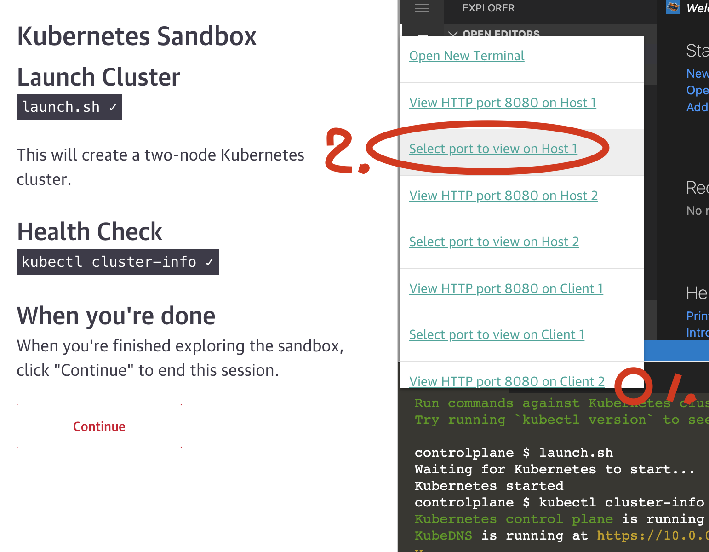

# Advanced exercise

## http-echo operator

To follow this exercise use following oreilly sandbox.

- [Kubernetes sandbox](https://learning.oreilly.com/scenarios/kubernetes-sandbox/9781492062820/)

## Bootstrap sandbox

```bash
git clone https://github.com/philips-labs/k8s-software-concepts-day.git
cd k8s-software-concepts-day/advanced
./install-operator.sh
source ./install-go.sh
./install-registry.sh
```



1. To get your sandbox url click the url as shown in the picture.
   1. First click the `+`
   2. Then choose `Select port to view on Host 1`
2. Now fill in the registry port number 31500
3. Now copy the url from your webbrowser (e.g. `167772170-31500-host09nc.environments.katacoda.com` :warning: NOTE the 31500 port number in the URL.)

```bash
export REGISTRY=167772170-host09nc.environments.katacoda.com
```

### Excercises

#### 1. Install the operator

You might have to squeeze a few bugs before being able to deploy.

```bash
cd http-echo-operator
make generate
make manifests
export IMG=$REGISTRY/http-echo-operator:0.0.1
make docker-build
make docker-push
make deploy
kubectl get services,deployments,pods --namespace http-echo-operator-system
```

#### 2. Deploy the example deployment

- Deploy the example located in `config/samples/http_v1alpha1_httpecho.yaml` using 3 replicas.
- Check the example is deployed.
- Make a http call to the deployed service. What does it respond with?

#### 3. Modify the operator to be able to modify the response

- Introduce new parameter for the CRD
- Build and deploy a new version of your operator (`0.0.2`).
- Deploy `config/samples/http_v1alpha1_httpecho.yaml` using a new response message saying `Hi from Team X`.
- Make a http call to the deployed service. What does it respond with?
- Deploy `config/samples/http_v1alpha1_httpecho.yaml` using a new response message saying `Team X has achieved awesomeness`.
- Make a http call to the deployed service. What does it respond with?
